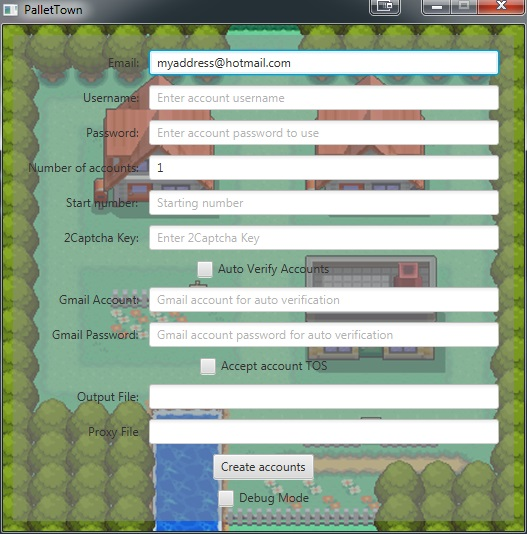
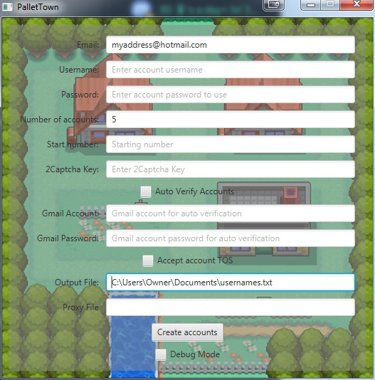
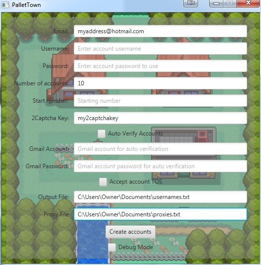
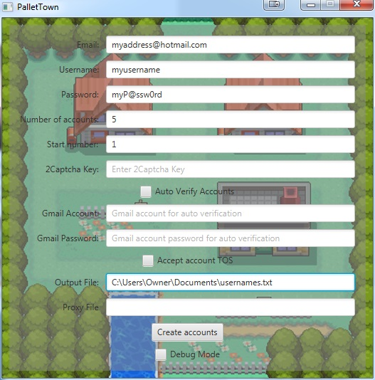
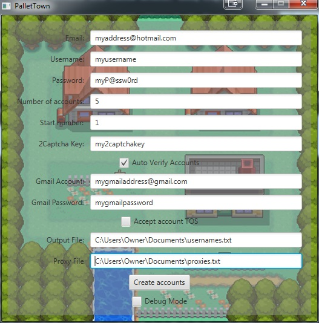

# Pallet Town

Pallet Town is a Java tool for creating Pokemon Trainer Club accounts.

You can download the latest release [here](https://github.com/novskey/PalletTown/releases) (Just download the .jar file) 

1. [Installation Guides](#install-guides)
    1. [Windows Installation](#windows-install)
    2. [Linux Installation](#linux-install)
    3. [Mac Installation](#mac-install)
2. [Usage](#usage)
    1. [Basic Examples](#basic-examples)
3. [FAQ](#faq)
4. [Wiki](http://pallettown.readthedocs.io/)

### Prerequisites

- [Java JRE](https://java.com/en/download/)
- [Google Chrome (Windows, Mac)](https://www.google.com.au/chrome/browser/)
- [Firefox (Linux)](https://www.mozilla.org/en-US/firefox/new/)
- [Python 2.7.12+](https://www.python.org/ftp/python/2.7.13/python-2.7.13.msi)
- [Selenium](http://selenium-python.readthedocs.io/installation.html)
- [ChromeDriver](https://sites.google.com/a/chromium.org/chromedriver/downloads)
- [PhantomJS (For 2captcha creation)](http://selenium-python.readthedocs.io/installation.html)

## <a name="install-guides"></a> Installation Guides

### <a name="windows-install"></a>Windows

#### Install prerequisites

##### Java JRE

Download and run the installer from https://java.com/en/download/.

##### Google Chrome

Download and run the installer from https://www.google.com.au/chrome/browser/.

##### Python

Download and run the installer from https://www.python.org/ftp/python/2.7.13/python-2.7.13.msi.

Make sure you select the "Add python.exe to path" option.


Click the start button and search for cmd.exe. Open it and paste this command:

`python --version`

If you get

`'python' is not recognized as an internal or external command, operable program, or batch file.`

You did not select the "Add python.exe to path" option. If you re-run the installer and select change installation, you can select it.

##### Selenium

Open cmd.exe and run:

`python -m pip install selenium`

##### ChromeDriver

Download the latest chromedriver.exe from https://sites.google.com/a/chromium.org/chromedriver/downloads.
Place chromedriver.exe in C:\Python27\Scripts (if you installed python to the default directory)

##### PhantomJS

Download the latest PhantomJS from http://phantomjs.org/download.html.

Extract the zip. Inside the phantomjs folder, you'll find phantomjs.exe in the bin folder. Move phantomjs.exe to the same place as chromedriver.exe (C:\Python27\Scripts)

#### Running Pallet Town

There a two ways of running pallet town. 

Starting it from cmd.exe with:

`java -jar PalletTown.jar`

Or simply double clicking the .jar file in Windows Explorer.

Starting it from cmd.exe will give you a log of what's happening in the program to let you know it's still running or if anything goes wrong.
Currently without running it from cmd.exe the program will just freeze until it has completed account creation.

###<a name="linux-install"></a> Linux

Tested on Ubuntu 16.04

#### Install prerequisites

##### Java JRE

Install Java8 through terminal with

```
sudo add-apt-repository ppa:webupd8team/java
sudo apt-get update
sudo apt-get install oracle-java8-installer
```

##### Firefox

Follow the instructions [here](https://support.mozilla.org/en-US/kb/install-firefox-linux) to install Firefox.

##### Python 2.7.12

Install python through terminal with

`sudo apt install python2.7`

Now install pip (A python package manager)

`sudo apt install python-pip`

##### Selenium

Install selenium through terminal with

`sudo python -m pip install selenium`

##### GeckoDriver

Download the latest geckodriver for your operating system from https://github.com/mozilla/geckodriver/releases.

Extract the tarball and place geckodriver in your path, such as /usr/bin.
(Your file names may differ from example)

```
tar -xvzf geckodriver-v0.13.0-linux32.tar.gz
sudo cp geckodriver /usr/bin/
```

##### PhantomJS

Download the latest PhantomJS for your operating system from http://phantomjs.org/download.html.

Extract the .tar.bz2 file and copy phantomjs/bin/phantomjs to /usr/bin.
(Your file names may differ from example)

```
tar -xjf phantomjs-2.1.1-linux-i686.tar.bz2
sudo cp phantomjs-2.1.1-linux-i686/bin/phantomjs /usr/bin/
```
#### Running Pallet Town

There a two ways of running pallet town. 

Starting it from terminal with:

`java -jar PalletTown.jar`

Or simply double clicking the .jar file in a file manager.

Starting it from terminal will give you a log of what's happening in the program to let you know it's still running or if anything goes wrong.
Currently without running it from terminal the program will just freeze until it has completed account creation.

## <a name="usage"></a> Usage

For more detailed documentation, please visit the [wiki](http://pallettown.readthedocs.io/).

### <a name="basic-examples"></a> Basic Examples

#### Create a single account with random details with manual captcha

- Enter any email address that is plusmail compatible into the Email field. (If you aren't sure, check the FAQ [here](#plusmail))
- Click Create Accounts

Username, password, and date of birth will be randomly generated and entered for you.
All you have to do is wait for the captcha to appear, and solve it.



#### Create 5 accounts with random details with manual captcha, and save the usernames/passwords to a text file

- Enter a plusmail compatible email address in the Email field. (See [the FAQ](#plusmail) if you're unsure)
- Enter the number 5 into the Number of accounts field.
- Click the Output File field, which will open up a file browser (It may take a while on some systems)
- Select your output file
- Click Create Accounts



#### Create 10 accounts with random details with 2captcha and a proxy list, and save the details to a file

- Enter a plusmail compatible email address in the Email field. (See [the FAQ](#plusmail) if you're unsure)
- Enter the number 10 into the Number of accounts field.
- Enter your 2Captcha key into the 2Captcha Key field.
- Click the Output File field, which will open up a file browser (It may take a while on some systems)
- Select your output file
- Click the Proxy File field, which will open a file browser (It may take a while on some systems)
- Select your proxy file. It should be formatted as 1 proxy per line, eg:
    ```
    13.41.123.231:23123
    14.51.233.135:23321
    ```
- Click Create Accounts



#### Create 5 numbered accounts (eg: user1,user2,user3) with a specific username and password, with manual captcha, and save the details to a file

- Enter a plusmail compatible email address in the Email field. (See [the FAQ](#plusmail) if you're unsure)
- Enter the username you want to use into the Username field.
- Enter the password you want to use into the Password field. (It must contain a capital letter, number, and symbol)
- Enter the number 5 into the Number of accounts field.
- Enter the number 1 into the Start number field. Start number is where the accounts will be numbered from, eg:
    ```
    Start number 1, 5 accounts:
    user1,user2,user3,user4,user5
    Start number 10, 5 accounts:
    user10,user11,user12,user13,user14
    ```
- Click the Output File field, which will open up a file browser (It may take a while on some systems)
- Select your output file
- Click Create Accounts



#### Create 10 accounts with random details, using 2Captcha, automatic Gmail verification, save to file, and use proxy list

- Enter a plusmail compatible email address in the Email field. (See [the FAQ](#plusmail) if you're unsure)
  **Note: The email address you enter here must be setup to forward/redirect to the Gmail account you intend to use. See [here](#hotmail-forwarding) for how to set it up.**
- Enter the number 10 into the Number of accounts field.
- Enter your 2Captcha key into the 2Captcha Key field.
- Check the Auto Verify Accounts box.
- Enter your Gmail account username. (eg: mygmail@gmail.com)
- Enter your Gmail account password.
- Click the Output File field, which will open up a file browser (It may take a while on some systems)
- Select your output file
- Click the Proxy File field, which will open a file browser (It may take a while on some systems)
- Select your proxy file. It should be formatted as 1 proxy per line, eg:
    ```
    13.41.123.231:23123
    14.51.233.135:23321
    ```
- Click Create Accounts



## <a name="faq"></a> FAQ

#### <a name="faq-plusmail"></a> What is a "plusmail compatible email address"?

A plusmail compatible email address is an email where emails sent to myaddress+123@domain.com get redirected to myaddress@domain.com.
This is a very useful feature as it allows the creation of many PTC accounts with a single email address.

Hotmail, Outlook, and Gmail support this feature, however Niantic is able to detect it being used in gmail addresses so it won't work for Pallet Town.

You can test if your email service supports plusmail like so:
    
For address myaddress@domain.com, send an email to myaddress+1234@domain.com, you should receive it in your email myaddress@domain.com.
If it doesn't arrive in your email, your email service does not support the plusmail trick, and you'll need a different email to use Pallet Town.

#### <a name="hotmail-forwarding"></a> How do I automatically forward emails from Hotmail to Gmail?